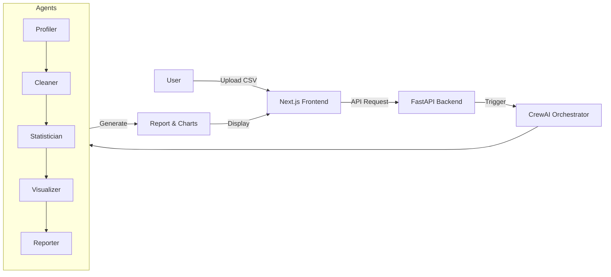

# Explainable Multi-Agent System for Automated Data Analysis


**EMAS-ADA** transforms raw datasets into comprehensive, insightful reports with explainable visualizations using a team of specialized AI agents.

## Problem Statement
Data analysis is often a bottleneck: it is time-consuming, prone to human bias, and requires specialized coding skills (Python/R). Business users often rely on data scientists for basic insights, creating delays. Furthermore, "black box" automated tools often lack transparency, making it hard to trust their conclusions.

## Solution Overview
This system automates the Exploratory Data Analysis (EDA) pipeline using a Multi-Agent System. It ingests CSV/Excel files, orchestrates specialized agents to profile, clean, analyze, and visualize the data, and delivers a fully explainable report via a modern web interface. It integrates XAI (SHAP/LIME) to ensure every insight is transparent and trustworthy.

## Architecture Diagram



## Architecture Explanation
- **Data Ingestion Module**: `src/api/main.py` handles file uploads via FastAPI, validating formats (.csv, .xlsx) and storing them safely.
- **Agent Orchestrator**: `src/crew/` utilizes CrewAI to manage the lifecycle of agents, ensuring tasks are executed in the correct dependency order.
- **Specialized Agents**: 
    - `Profiler`: Audits data quality and structure.
    - `Cleaner`: Implements cleaning logic (imputation, outlier removal) using Pandas.
    - `Statistician/Visualizer`: leverages Scikit-learn and Matplotlib/Seaborn to generate insights.
- **XAI Engine**: `src/agents/xai_agent.py` calculates SHAP values and LIME explanations to interpret model findings.
- **Frontend UI**: A Next.js application that provides a real-time dashboard for monitoring progress and viewing interactive reports.

## Key Features
- **Multi-Agent Collaboration**: specialized roles ensure depth in every aspect of analysis (cleaning, stats, viz).
- **Explainable AI (XAI)**: Integrated SHAP and LIME for transparent model interpretation.
- **Automated Data Cleaning**: Intelligent handling of missing values and outliers with audit logs.
- **Interactive Dashboard**: Modern UI for easy upload, monitoring, and report consumption.
- **Dual-Format Reporting**: Generates both Markdown (for devs) and HTML (for business) reports.

## Tech Stack (With Purpose)
- **Python 3.10+**: The core runtime for backend logic and data science libraries.
- **CrewAI**: Orchestrates the multi-agent workflow and task delegation.
- **FastAPI**: Provides a high-performance, async REST API for the frontend.
- **Next.js 14**: Powers the responsive, server-side rendered user interface.
- **Pandas & NumPy**: High-performance data manipulation and analysis.
- **Scikit-learn**: Machine learning utilities for predictive modeling and clustering.
- **SHAP & LIME**: Explainable AI libraries for model transparency.

## System Workflow (Chronological Processing Steps)
1.  **Upload**: User uploads a dataset via the Web UI.
2.  **Profiling**: The `Profiler` agent scans the file for schema, types, and quality issues.
3.  **Cleaning**: The `Cleaner` agent executes transformations to fix identified issues.
4.  **Analysis**: `Statistician` and `Visualizer` agents run in parallel to generate stats and charts.
5.  **Explanation**: The `XAIAgent` computes feature importance and local explanations.
6.  **Reporting**: The `Reporter` agent compiles all artifacts into a cohesive narrative.
7.  **Review**: User views the final report and charts on the Dashboard.

## Input Format
- **Data**: `.csv`, `.xlsx`, or `.xls`.
- **Requirements**: Tabular data with headers.

## Output Format
- **Interactive Report**: displayed directly in the UI.
- **Files**:
    - `report.md`: Comprehensive markdown report.
    - `cleaned_data.csv`: The processed dataset.
    - `charts/*.png`: Generated visualizations.

## Installation Instructions
1.  **Clone the Repository**:
    ```bash
    git clone https://github.com/siddharth-narigra/major-project-II.git
    cd major-project-II
    ```

2.  **Backend Setup**:
    ```bash
    python -m venv venv
    .\venv\Scripts\activate       # Windows
    # source venv/bin/activate    # Linux/Mac
    pip install -r requirements.txt
    ```

3.  **Frontend Setup**:
    ```bash
    cd frontend
    npm install
    ```

4.  **Configuration**:
    - Copy `.env.example` to `.env`.
    - Add your API Key (e.g., `OPENROUTER_API_KEY=sk-...`).

## How to Run
1.  **Start Backend**:
    ```bash
    # From root directory
    uvicorn src.api.main:app --reload
    ```
2.  **Start Frontend**:
    ```bash
    # From frontend directory
    npm run dev
    ```
3.  **Access App**: Open `http://localhost:3000`.

## Folder Structure
```
solid-octo-robot/
├── src/
│   ├── agents/              # Agent definitions (Cleaner, Profiler, etc.)
│   ├── api/                 # FastAPI endpoints
│   ├── crew/                # CrewAI orchestration
│   └── tools/               # Custom tools (DataStore, Plotting)
├── frontend/                # Next.js Web Application
├── output/                  # Generated artifacts (Reports, Charts)
├── uploaded/                # Temporary storage for uploads
├── requirements.txt         # Backend dependencies
└── README.md                # This document
```

## Limitations
- **LLM Dependency**: Requires an active internet connection and API key for the LLM provider.
- **Processing Time**: Large datasets may take longer to process due to LLM latency.
- **Token Costs**: Extensive analysis of very large files may consume significant API tokens.

## License
[MIT License](LICENSE)
