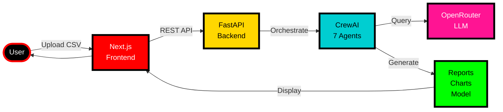
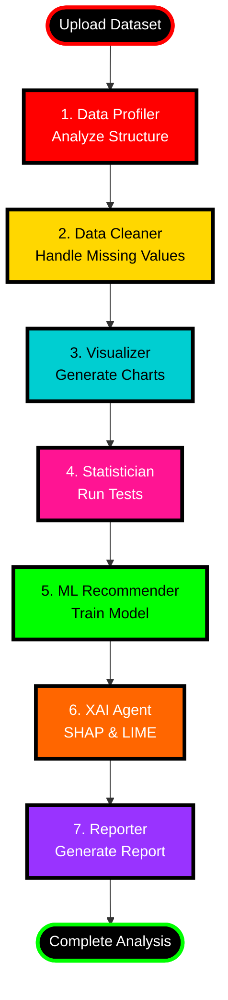
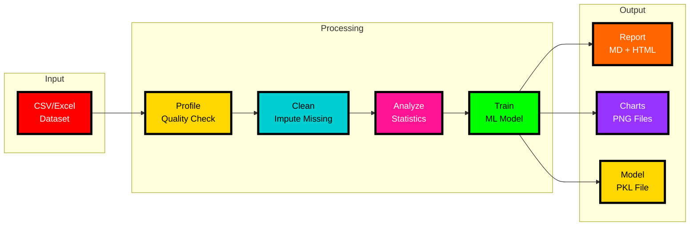
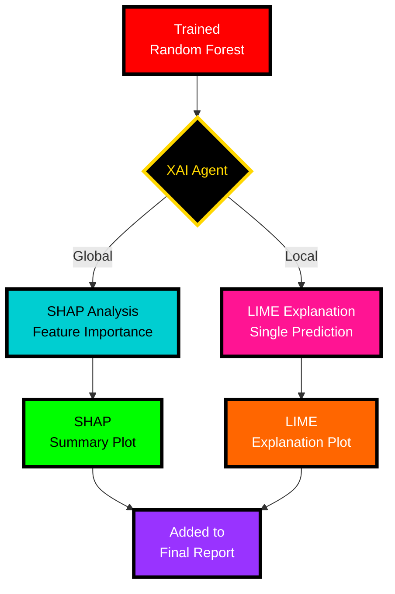
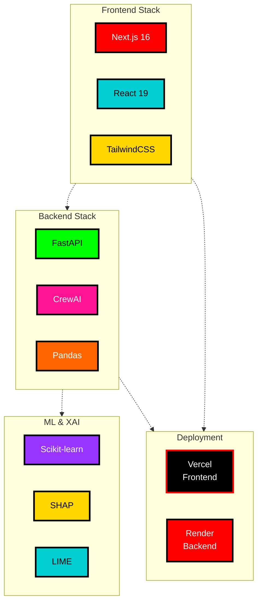

# Project Diagrams - Presentation Version

## 1. System Architecture Overview

**Key Points:**
- User uploads dataset via modern web UI
- FastAPI backend handles requests
- CrewAI orchestrates 7 specialized agents
- OpenRouter provides LLM intelligence
- Generates reports, charts, and trained models

---

## 2. Multi-Agent Workflow

**Key Points:**
- Sequential execution ensures quality
- Each agent specializes in one task
- Context flows from one agent to next
- Fully automated pipeline

---

## 3. Data Flow & Processing

**Key Points:**
- Raw data → Cleaned data → Analysis
- Generates 3 types of outputs
- All artifacts saved for reuse

---

## 4. Explainability (XAI) Process

**Key Points:**
- SHAP: Global feature importance
- LIME: Individual prediction explanation
- Makes "black box" models transparent
- Visualizations included in report

---

## 5. Technology Stack

**Key Points:**
- Modern tech stack
- Free deployment options
- Industry-standard ML libraries
- Scalable architecture

---

## Quick Reference

| Component | Technology | Purpose |
|-----------|-----------|---------|
| Frontend | Next.js | User interface |
| Backend | FastAPI | REST API server |
| Orchestration | CrewAI | Multi-agent coordination |
| LLM | OpenRouter | AI-powered analysis |
| ML | Scikit-learn | Model training |
| XAI | SHAP + LIME | Explainability |
| Deployment | Vercel + Render | Cloud hosting |

---

## Presentation Tips

**For Each Diagram:**

1. **System Architecture** - "Our system has 5 main components working together"
2. **Multi-Agent Workflow** - "7 specialized agents work sequentially like an assembly line"
3. **Data Flow** - "Data goes through 4 stages: Profile → Clean → Analyze → Train"
4. **XAI Process** - "We use both SHAP and LIME to explain our model's predictions"
5. **Tech Stack** - "We use modern, industry-standard technologies"

**Keep it Simple:**
- Point to each box and explain in one sentence
- Use the colored sections to guide attention
- Emphasize automation and AI-powered analysis
